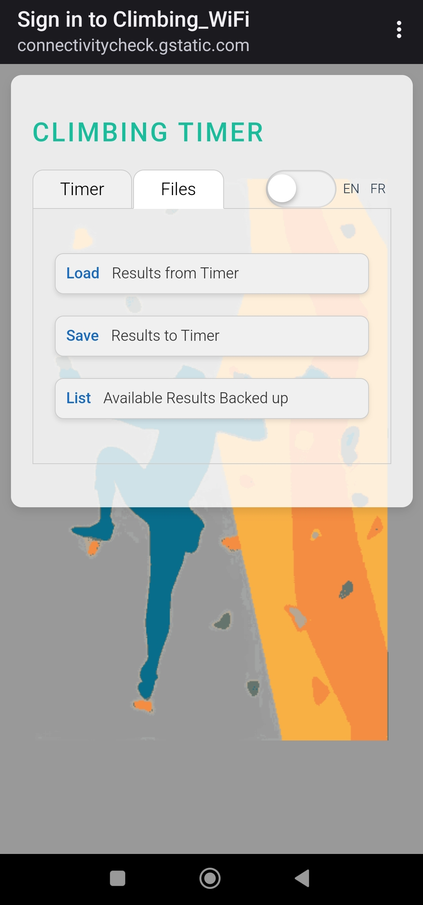

# 🚀 ESP8266 Web Server Timer Project

## Overview

Welcome to the **ESP8266 Web Server Timer Project**! A Simple *"Remote Smart Timer"*
- Connect with your SmartPhone to the **ESP8266 WiFi Access Point** *+ password*
- Open the **Home Page** provided by the Access Point
- **Enter a name** for the event you want to Time & click **"Add"**
- *READY, SET...GO!* **Hit the START Button** & start the activity
  - You can either **STOP** the Timer from the SmartPhone (the way you started it)
  - OR, by pressing the **Push Button** on the ESP8266, at a target location
- This unique feature is helpfull for activities where a coach starts the timer (from the phone) and needs the trainee to reach to a remote button & stop timer himself/herself for accurate timing.
- This was successfully tested for **climbing**, **running** and **Physical Education** activities. eg. ESP8266 Button would be set on top of the climbing wall.

The project is designed for **electronic hobbyists** to get familiar with a tiny **fullstack IoT**, on inexpensive **ESP8266** boards. All web design can be tweaked and adapted for other sports & usage. Timer stores & displays all results on a local partition in RAM, with extra capabilities such as: sorting, loading, downloading as CSV. 

<a href="images/screenshot02.jpg">
  
</a>
<a href="images/screenshot01.jpg">
  
</a>

## Features

- **Soft Access Point (AP)**: The ESP8266 board starts a soft AP for easy connectivity.
- **Captive Web Portal**: Provides a redirection to friendly web interface once connected to Access Point.
- **LittleFS Filesystem**: Uses LittleFS to manage web files (css, js) and store timer results in RAM, to keep them available directly on the ESP8266 partition, even after power-off
- **Web Timer**: Times multiple events, stored in a table, with filtering and exporting capabilities
- **ESP8266 Stop Button**: Start the timer from a web page (e.g., smartphone) and stop it physically upon reaching the destination (e.g., climbing, running, self-timing).
- **Responsive Web Interface**: Fully customizable and fits most smartphones or computers.
- **Public and Open Source**: Available for everyone to enjoy, enhance & improve!

## Bill of Material
- [**ESP8266 Wemos D1 mini**](https://www.amazon.fr/BaYuYPOO-ESP8266-ESP-12F-d%C3%A9veloppement-NodeMCU/dp/B0D1FL7JS9/ref=sr_1_12?crid=37ONHSL5I5QAM&dib=eyJ2IjoiMSJ9.kQiyqgx_l5obGorvCmk2aL808-TIIAN0Wl37mXoDtUj1t0j9Is5GSHW1VY2eo7id3Rz6MbSrj4IHiDFIEKZHAwrbxtashMn26vO7S14HaeboPj0n19_fRIDo7qDHioDHOdufPyOBSAqrT4OMgBjDgPkmarOGoxykiTI9rqgILr62h2xylOc9KefDX2ypsndcOWNgF9mfQlrew7Qi4aDg2_xWhnBMFNHm30WZLlN0f2h8sz7lkDK0Falxb17n_pKiPI0nVdW4O8FU-yw7hQJ2saYj0YX7pTrTzVNsTw_6BpM.CsMgy9m8IOdjFn2NFxfbJRuoGloosK-2JhCW92AZETs&dib_tag=se&keywords=wemos+d1+mini+esp8266&qid=1731795405&sprefix=wemos+d1+mini+esp%2Caps%2C172&sr=8-12) (~3.30 EUR)
- [**Switch Button**](https://www.amazon.fr/Bouton-Poussoir-Interrupteur-interrupteurs-bouton-poussoir-%C3%A9lectrique/dp/B09XWP7WY8/ref=sr_1_4_sspa?__mk_fr_FR=%C3%85M%C3%85%C5%BD%C3%95%C3%91&crid=3R86HIP4ZRI0U&dib=eyJ2IjoiMSJ9._OicD_9eCm9zR-m91D0eMv5CE_b2iSG-cVbOhcpoyV1sBsu_vrs4WWZRBDEutrzUB09plYjnk-OSMhw71vjnNOX5VsPUgVOi9gy0wy6dRU2n9F2QPh66JG0ATgkkE4C_3AnnSz6kOKHZNtLQA7ScSvhCoEiexgdpJbYiZGXlIiFjrNoX2Y-yqF3O7FFD9iRBBE4mbgVdlxiryq4FB-STcGb-IN8KkZ5P_S6ArBYJqVtLx58ydbrswGhHDK8Uk-scMXEebdGim5KAN-FCGpXC9SPG08oN6Bu96EQnkILGkcc.kP94sXr9X3jHxDxgeKkeTKBvcz1crc3bS7bQe1gMVag&dib_tag=se&keywords=arduino%2Bpush%2Bbutton&qid=1731795847&sprefix=arduino%2Bpush%2Bbutton%2Caps%2C111&sr=8-4-spons&sp_csd=d2lkZ2V0TmFtZT1zcF9hdGY&th=1) (~4.40 EUR)
- [**3xAA Battery Case**](https://www.amazon.fr/%C3%A9tui-rangement-piles-ferm%C3%A9-interrupteur/dp/B08GWX3Y8K/ref=sr_1_15?__mk_fr_FR=%C3%85M%C3%85%C5%BD%C3%95%C3%91&crid=2UZF61EWUXL54&dib=eyJ2IjoiMSJ9.Ux8npnX_3vzoN7QFI60m3lryF3UudfMITG4WKo990Lp5mEg7iPUa8QqInhDNztJVz3hXCt7iNM013cI8_W9FNzm-HYtulQwJiLLgpbPkYxZ2-FC8_2hlqqORSO0r5u06J7Csce4mQIUI7Tp7OPpjgGVT9zHjJNQVQWb0Yi7WxC2kRBs7oRnvvSmNphDlNJrFNMgbSPSWSV-SIdblD9bCHNh9d7fNRZY9OevdJ9jeDflrRVEMOnsQDUVGfMKd3T9GdOvCwqZvrd6PAnrXbdI98LiTshFV-XcgbjxQhroI5LA.iqLaWRQmlsXi-Av0pnojk7r85OP9hDKaFfRMgLZffQU&dib_tag=se&keywords=3x%2Baa%2Bsupport&qid=1731798860&sprefix=3x%2Baa%2Bsupport%2Caps%2C138&sr=8-15&th=1) (~5.20 EUR) or [**Mini PowerBank USB**](https://www.amazon.fr/gp/product/B082PM6TJR/ref=ewc_pr_img_1?smid=A9EHTJ24BA83Y&th=1) (~10.00 EUR)

## Files
##### To Build Project in Arduino IDE
- **ESP8266_WebServer.ino**: The main Arduino sketch.
- **my_littlefs_lib.cpp & my_littlefs_lib.h**: Custom libraries for handling LittleFS operations.
##### To Copy on the ESP8266 LittleFS Partition
- **index.html**: The main web page served by the server.
- **style.css**: Stylesheet to make the web interface look sleek.
- **script.js**: JavaScript to add interactivity to the web page.

## Getting Started

1. **Clone this repository**: `git clone https://github.com/your-username/ESP8266_WebServer_Project.git`
2. **Upload the sketch**: Compile and upload `ESP8266_WebServer.ino` to your ESP8266 board.
3. [**Install LittleFS Plugin for Arduino IDE**](https://www.amazon.fr/gp/product/B082PM6TJR/ref=ewc_pr_img_1?smid=A9EHTJ24BA83Y&th=1)
4. Copy ```index.html, style.css, script.js``` to the LittleFS partition (see step 3)
5. Attach a **Push Button** to ESP8266, connecting Pin "**D2**" and "**G**" (Ground)
6. Power-On ESP8266 using one of 2 options:
   - PowerBank plugged to USB connector of the board, or
   - a 3xAA Battery Case connected to +5 VCC Pin (red wire) and Ground (black wire)
8. **Connect your SmartPhone to the Soft AP**: "```Climbing_WiFi```" network is created by the ESP8266 (pwd: *```climbclimb```*)
9. **Open the Web Portal**: Visit the captive web portal using your web browser.

<a href="images/breadboard01.png">
  
</a>

## Contributing

We welcome contributions from everyone! Feel free to **fork** the repository, **submit pull requests**, or simply suggest improvements through **issues**. Let's make this project even more awesome together! 🎉

